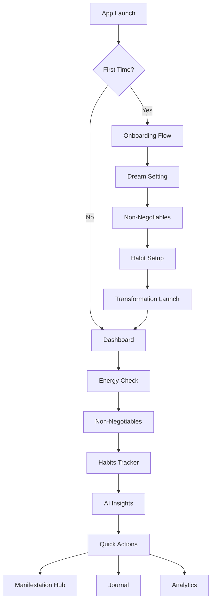

# Manifest - Product Requirements Document

## 1. Product Overview

Manifest is a transformational manifestation engine that converts unmotivated individuals into disciplined achievers overnight. This isn't a productivity app - it's a life-changing system that makes success automatic and discipline inevitable.

The app combines Apple's design elegance with Google's intelligent systems to create an experience so intuitive it feels like breathing. Users who've never worked a day in their life will open this app and immediately change their trajectory forever.

Target: Create an app so essential that users can't imagine life without it after Day 1, achieving 90%+ retention and becoming part of their daily operating system.

## 2. Core Features

### 2.1 User Roles

| Role | Registration Method | Core Permissions |
|------|---------------------|------------------|
| Manifest User | Email/Google signup | Full access to manifestation tracking, habit building, AI insights, and progress analytics |

### 2.2 Feature Module

Our Manifest app consists of the following essential pages:

1. **Onboarding Flow**: Dream setting, non-negotiables selection, habit configuration, transformation initiation
2. **Dashboard**: Live command center with dynamic greetings, stats tracking, energy check, habits management
3. **Manifestation Hub**: Goal visualization, progress tracking, milestone celebrations
4. **Habits Tracker**: Building/breaking habits with streak tracking and micro-rewards
5. **AI Insights**: Contextual intelligence, pattern recognition, predictive recommendations
6. **Analytics**: Progress visualization, correlation insights, achievement patterns
7. **Journal**: Reflection space, gratitude tracking, daily wins capture

### 2.3 Page Details

| Page Name | Module Name | Feature description |
|-----------|-------------|---------------------|
| Onboarding Flow | Dream Setting | Capture user's biggest manifestation goal with emotional connection |
| Onboarding Flow | Non-Negotiables Setup | Select 3 daily must-do tasks that drive toward their goal |
| Onboarding Flow | Habit Configuration | Choose one habit to build and one to break for transformation |
| Onboarding Flow | Transformation Launch | Motivational completion with "You're ready to transform" moment |
| Dashboard | Dynamic Header | Time-contextual greetings (Rise and Manifest, Keep Pushing, Finish Strong) |
| Dashboard | Live Stats Cards | Real-time manifestation progress, streak tracking with fire emoji, energy levels |
| Dashboard | Energy Check | Morning energy assessment (Low/Medium/High/Peak) for day optimization |
| Dashboard | Non-Negotiables | Today's must-do tasks with satisfying completion animations and XP rewards |
| Dashboard | Quick Actions | One-tap access to Manifest, Goals, Journal, Analytics with gradient buttons |
| Manifestation Hub | Goal Visualization | Progress bars, achievement milestones, daily contribution tracking |
| Manifestation Hub | Success Metrics | Real-time updates on manifestation progress with encouraging insights |
| Habits Tracker | Building Habits | Green-themed positive habits with streak counters and completion rewards |
| Habits Tracker | Breaking Habits | Red-themed habits to eliminate with resistance tracking and victory celebrations |
| Habits Tracker | Micro-Interactions | Satisfying checkbox animations, XP gains, streak fire growth |
| AI Insights | Contextual Intelligence | Time-aware recommendations (morning energy optimization, evening reflection) |
| AI Insights | Pattern Recognition | Behavioral analysis showing success correlations and optimization suggestions |
| Analytics | Progress Visualization | Beautiful charts showing habit consistency, manifestation progress, energy patterns |
| Analytics | Achievement Insights | Data-driven insights like "73% more productive after meditation" |
| Journal | Daily Reflection | Evening wind-down with gratitude, wins, and tomorrow preparation |
| Journal | Manifestation Journaling | Visualization exercises and affirmation tracking |

## 3. Core Process

**First-Time User Journey:**
1. User opens app → Onboarding begins with "What's your biggest dream?"
2. Sets manifestation goal → Selects 3 non-negotiables → Chooses habits to build/break
3. Completes setup → Sees "You're ready to transform" → Enters Dashboard

**Daily User Flow:**
1. **Morning (6-12pm):** Opens app → Energy check → Reviews non-negotiables → Gets AI-powered day planning
2. **Afternoon (12-5pm):** Quick check-in → Progress updates → Motivation boost → Habit completions
3. **Evening (5pm+):** Reflection mode → Journal entries → Tomorrow preparation → Streak celebration

**Habit Completion Flow:**
1. User sees habit → Taps checkbox → Satisfying animation plays → XP gained → Streak updated → AI insight appears

## 4. User Interface Design

### 4.1 Design Style

- **Primary Colors:** Deep purple gradients (#1e1b4b to #312e81), electric blue accents (#3b82f6)
- **Secondary Colors:** Manifestation pink (#ec4899), success green (#10b981), energy orange (#f59e0b)
- **Button Style:** Rounded glass-morphism with gradient backgrounds, hover scale effects, satisfying micro-animations
- **Typography:** Clean sans-serif, gradient text effects for headers, clear hierarchy with 5xl headers to xs details
- **Layout Style:** Card-based design with backdrop blur, floating elements, responsive grid systems
- **Animation Style:** Smooth transitions, satisfying completion animations, floating orb backgrounds, pulse effects
- **Icon Style:** Emoji-based for emotional connection (🔥 for streaks, ⚡ for energy, ✨ for manifestation)

### 4.2 Page Design Overview

| Page Name | Module Name | UI Elements |
|-----------|-------------|-------------|
| Dashboard | Background | Dark gradient (slate-950 to indigo-950) with floating purple/indigo orbs, backdrop blur effects |
| Dashboard | Header | 5xl gradient text, dynamic greetings, streak counter with motivational messages |
| Dashboard | Stats Cards | Glass-morphism cards with white/5 opacity, hover effects, progress bars with gradient fills |
| Dashboard | Energy Check | Four-button energy selector with emoji indicators, hover scale animations |
| Dashboard | Habits Section | Two-column grid (Building/Breaking), checkbox animations with XP rewards |
| Dashboard | AI Insights | Gradient border cards with brain emoji, contextual intelligence display |
| Dashboard | Quick Actions | 2x4 grid of gradient buttons with emoji icons, hover scale effects |
| Dashboard | Floating Action | Fixed bottom-right circular button with rotation animation on hover |
| Onboarding | Flow Design | Full-screen cards with smooth transitions, progress indicators, emotional imagery |
| Manifestation Hub | Progress Visualization | Large progress bars, milestone markers, achievement celebrations |
| Analytics | Chart Design | Beautiful gradient charts, correlation insights, data-driven motivational messages |

### 4.3 Responsiveness

Desktop-first design with mobile-adaptive layouts. Touch interaction optimization for mobile with swipe gestures for task completion. Responsive grid systems that adapt from 4-column desktop to single-column mobile while maintaining visual hierarchy and interaction satisfaction.
