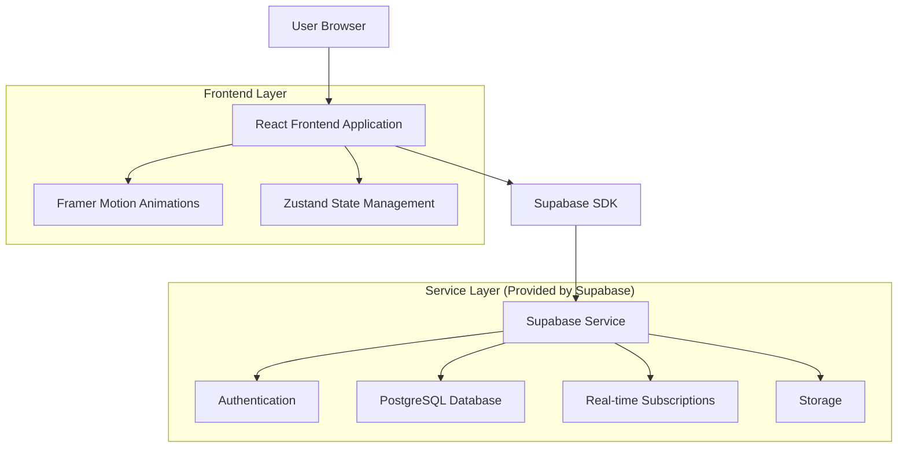
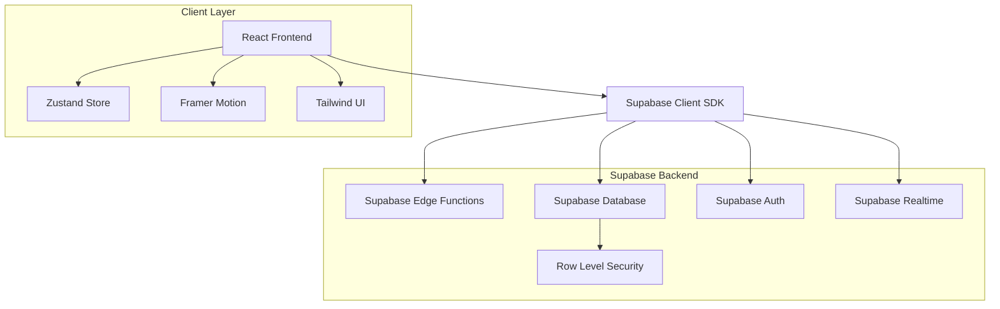
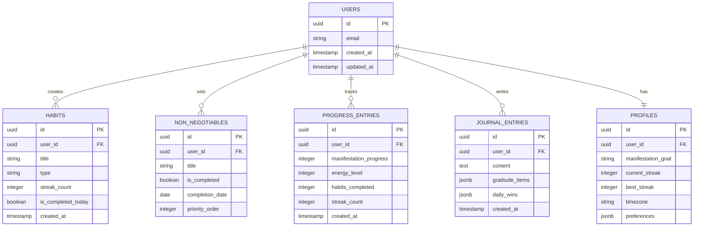

# Manifest - Technical Architecture Document

## 1. Architecture Design



## 2. Technology Description

- **Frontend:** React@18 + TypeScript + Tailwind CSS + Vite
- **Animations:** Framer Motion for micro-interactions and page transitions
- **State Management:** Zustand for lightweight, intuitive state management
- **Backend:** Supabase (Authentication, Database, Real-time, Storage)
- **Deployment:** Vercel for optimized React deployment

## 3. Route Definitions

| Route | Purpose |
|-------|---------|
| / | Dashboard - Main command center with live stats, habits, and AI insights |
| /onboarding | First-time user setup flow for manifestation goals and habits |
| /manifest | Manifestation hub with goal visualization and progress tracking |
| /habits | Detailed habits management with building/breaking categories |
| /insights | AI-powered insights and pattern recognition dashboard |
| /analytics | Progress visualization and achievement correlation analysis |
| /journal | Daily reflection, gratitude tracking, and manifestation journaling |
| /auth | Authentication pages (login/signup) with Supabase integration |

## 4. API Definitions

### 4.1 Core API

**User Authentication (Handled by Supabase Auth)**
```
POST /auth/v1/signup
POST /auth/v1/token
POST /auth/v1/logout
```

**User Profile Management**
```
GET /rest/v1/profiles
PATCH /rest/v1/profiles
```

Request:
| Param Name | Param Type | isRequired | Description |
|------------|------------|------------|-------------|
| manifestation_goal | string | true | User's primary manifestation target |
| energy_preference | string | false | Preferred energy tracking method |
| timezone | string | false | User's timezone for contextual features |

**Habits Management**
```
GET /rest/v1/habits
POST /rest/v1/habits
PATCH /rest/v1/habits
DELETE /rest/v1/habits
```

Request:
| Param Name | Param Type | isRequired | Description |
|------------|------------|------------|-------------|
| title | string | true | Habit name or description |
| type | string | true | 'building' or 'breaking' |
| streak_count | integer | false | Current streak days |
| is_completed_today | boolean | false | Today's completion status |

**Non-Negotiables Tracking**
```
GET /rest/v1/non_negotiables
POST /rest/v1/non_negotiables
PATCH /rest/v1/non_negotiables
```

**Progress Analytics**
```
GET /rest/v1/progress_entries
POST /rest/v1/progress_entries
```

Example Response:
```json
{
  "id": "uuid",
  "user_id": "uuid",
  "manifestation_progress": 35,
  "energy_level": 4,
  "habits_completed": 3,
  "streak_count": 21,
  "created_at": "2024-01-15T08:00:00Z"
}
```

## 5. Server Architecture Diagram



## 6. Data Model

### 6.1 Data Model Definition



### 6.2 Data Definition Language

**Users Table (Managed by Supabase Auth)**
```sql
-- Supabase automatically creates auth.users table
-- We extend with profiles table for app-specific data
```

**Profiles Table**
```sql
CREATE TABLE profiles (
    id UUID PRIMARY KEY DEFAULT gen_random_uuid(),
    user_id UUID REFERENCES auth.users(id) ON DELETE CASCADE,
    manifestation_goal TEXT NOT NULL,
    current_streak INTEGER DEFAULT 0,
    best_streak INTEGER DEFAULT 0,
    timezone TEXT DEFAULT 'UTC',
    preferences JSONB DEFAULT '{}',
    created_at TIMESTAMP WITH TIME ZONE DEFAULT NOW(),
    updated_at TIMESTAMP WITH TIME ZONE DEFAULT NOW()
);

-- Row Level Security
ALTER TABLE profiles ENABLE ROW LEVEL SECURITY;
GRANT SELECT ON profiles TO anon;
GRANT ALL PRIVILEGES ON profiles TO authenticated;

CREATE POLICY "Users can view own profile" ON profiles
    FOR SELECT USING (auth.uid() = user_id);
CREATE POLICY "Users can update own profile" ON profiles
    FOR UPDATE USING (auth.uid() = user_id);
```

**Habits Table**
```sql
CREATE TABLE habits (
    id UUID PRIMARY KEY DEFAULT gen_random_uuid(),
    user_id UUID REFERENCES auth.users(id) ON DELETE CASCADE,
    title TEXT NOT NULL,
    type TEXT CHECK (type IN ('building', 'breaking')) NOT NULL,
    streak_count INTEGER DEFAULT 0,
    is_completed_today BOOLEAN DEFAULT FALSE,
    created_at TIMESTAMP WITH TIME ZONE DEFAULT NOW(),
    updated_at TIMESTAMP WITH TIME ZONE DEFAULT NOW()
);

-- Indexes
CREATE INDEX idx_habits_user_id ON habits(user_id);
CREATE INDEX idx_habits_type ON habits(type);

-- Row Level Security
ALTER TABLE habits ENABLE ROW LEVEL SECURITY;
GRANT SELECT ON habits TO anon;
GRANT ALL PRIVILEGES ON habits TO authenticated;

CREATE POLICY "Users can manage own habits" ON habits
    FOR ALL USING (auth.uid() = user_id);
```

**Non-Negotiables Table**
```sql
CREATE TABLE non_negotiables (
    id UUID PRIMARY KEY DEFAULT gen_random_uuid(),
    user_id UUID REFERENCES auth.users(id) ON DELETE CASCADE,
    title TEXT NOT NULL,
    is_completed BOOLEAN DEFAULT FALSE,
    completion_date DATE DEFAULT CURRENT_DATE,
    priority_order INTEGER DEFAULT 1,
    created_at TIMESTAMP WITH TIME ZONE DEFAULT NOW()
);

-- Indexes
CREATE INDEX idx_non_negotiables_user_id ON non_negotiables(user_id);
CREATE INDEX idx_non_negotiables_date ON non_negotiables(completion_date);

-- Row Level Security
ALTER TABLE non_negotiables ENABLE ROW LEVEL SECURITY;
GRANT ALL PRIVILEGES ON non_negotiables TO authenticated;

CREATE POLICY "Users can manage own non-negotiables" ON non_negotiables
    FOR ALL USING (auth.uid() = user_id);
```

**Progress Entries Table**
```sql
CREATE TABLE progress_entries (
    id UUID PRIMARY KEY DEFAULT gen_random_uuid(),
    user_id UUID REFERENCES auth.users(id) ON DELETE CASCADE,
    manifestation_progress INTEGER CHECK (manifestation_progress >= 0 AND manifestation_progress <= 100),
    energy_level INTEGER CHECK (energy_level >= 1 AND energy_level <= 4),
    habits_completed INTEGER DEFAULT 0,
    streak_count INTEGER DEFAULT 0,
    created_at TIMESTAMP WITH TIME ZONE DEFAULT NOW()
);

-- Indexes
CREATE INDEX idx_progress_entries_user_id ON progress_entries(user_id);
CREATE INDEX idx_progress_entries_created_at ON progress_entries(created_at DESC);

-- Row Level Security
ALTER TABLE progress_entries ENABLE ROW LEVEL SECURITY;
GRANT ALL PRIVILEGES ON progress_entries TO authenticated;

CREATE POLICY "Users can manage own progress" ON progress_entries
    FOR ALL USING (auth.uid() = user_id);
```

**Journal Entries Table**
```sql
CREATE TABLE journal_entries (
    id UUID PRIMARY KEY DEFAULT gen_random_uuid(),
    user_id UUID REFERENCES auth.users(id) ON DELETE CASCADE,
    content TEXT,
    gratitude_items JSONB DEFAULT '[]',
    daily_wins JSONB DEFAULT '[]',
    created_at TIMESTAMP WITH TIME ZONE DEFAULT NOW()
);

-- Indexes
CREATE INDEX idx_journal_entries_user_id ON journal_entries(user_id);
CREATE INDEX idx_journal_entries_created_at ON journal_entries(created_at DESC);

-- Row Level Security
ALTER TABLE journal_entries ENABLE ROW LEVEL SECURITY;
GRANT ALL PRIVILEGES ON journal_entries TO authenticated;

CREATE POLICY "Users can manage own journal entries" ON journal_entries
    FOR ALL USING (auth.uid() = user_id);
```

**Initial Data Setup**
```sql
-- Function to create profile on user signup
CREATE OR REPLACE FUNCTION public.handle_new_user()
RETURNS TRIGGER AS $$
BEGIN
  INSERT INTO public.profiles (user_id, manifestation_goal)
  VALUES (NEW.id, 'Set your manifestation goal');
  RETURN NEW;
END;
$$ LANGUAGE plpgsql SECURITY DEFINER;

-- Trigger to automatically create profile
CREATE TRIGGER on_auth_user_created
  AFTER INSERT ON auth.users
  FOR EACH ROW EXECUTE FUNCTION public.handle_new_user();
```